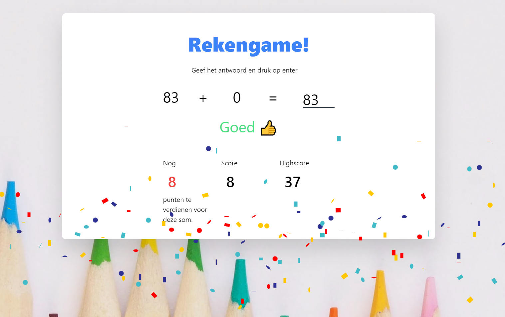

# Rekengame

Simpel rekenspelletje

## Spelregels

- Elke 20 seconden een som. Ongeveer groep 4 niveau.
- Hoe langer je wacht met antwoorden, hoe minder punten je krijgt
- Als je fout antwoord, verlies je al je punten
- Per browser wordt de highscore bijgehouden
